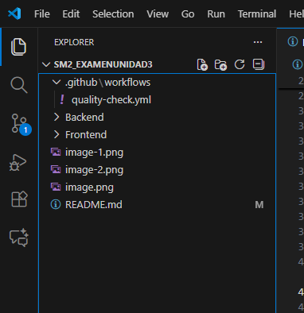
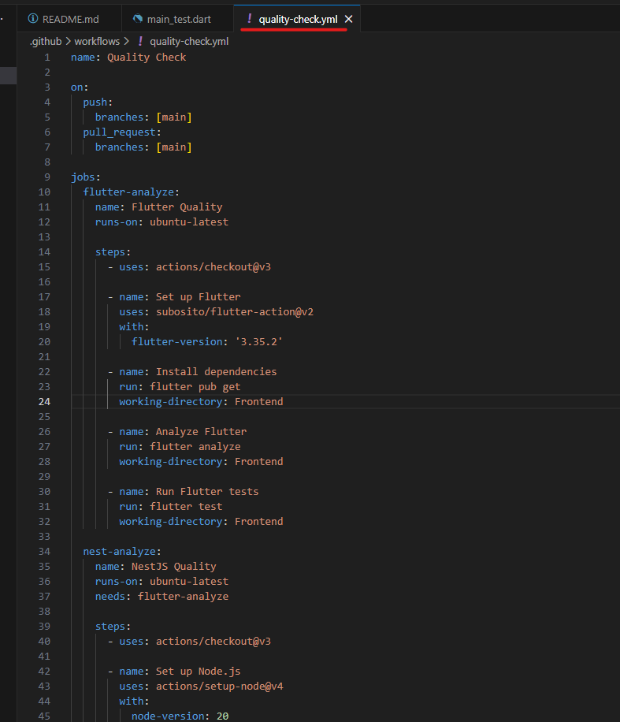
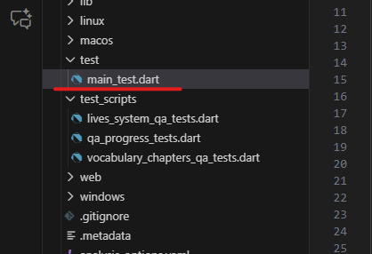
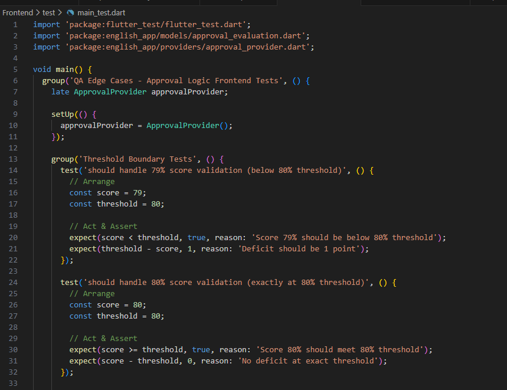
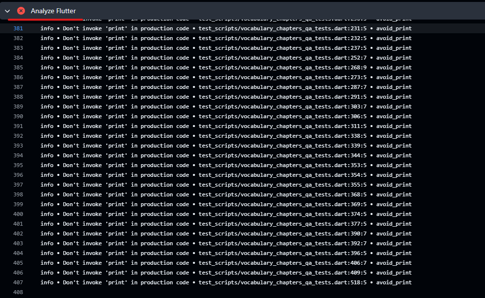
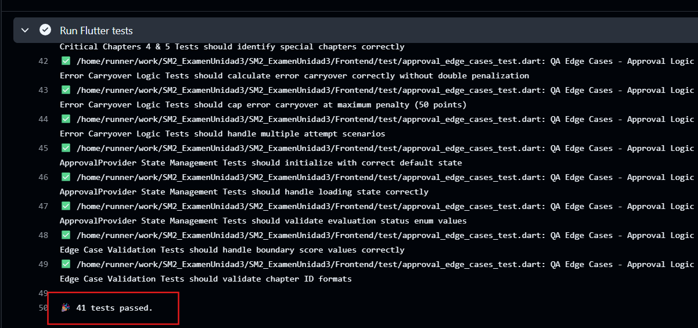
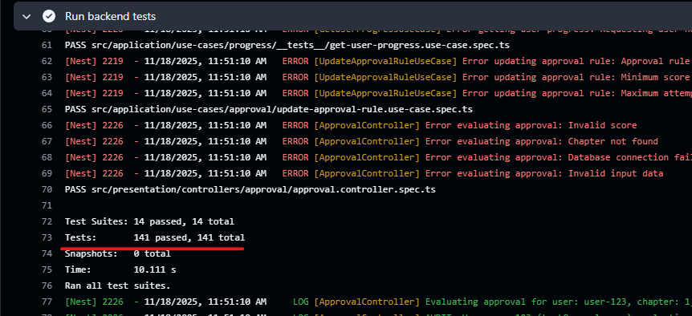

# EXAMEN PRÁCTICO – UNIDAD III  
## Desarrollo de Aplicaciones Móviles  
### Automatización de Calidad con GitHub Actions  
**Proyecto:** TeachSpeak – App móvil para aprender inglés técnico para Ingeniería de Sistemas  
**Estudiante:** Camila Fernanda Cabrera Catari  
**Fecha:** 18/11/2025  

---
## 📌 1. URL del Repositorio  
**Repositorio público:**  
👉 https://github.com/ccabrerastu/SM2_ExamenUnidad3

---
## 📌 2. Descripción del Proyecto: TeachSpeak  
TeachSpeak es una aplicación móvil desarrollada en Flutter cuyo objetivo es ayudar a estudiantes de Ingeniería de Sistemas a mejorar su dominio del inglés técnico mediante módulos interactivos, lecciones, glosarios y evaluaciones básicas.

---

## 📌 3. Estructura del Proyecto  

El repositorio contiene la siguiente estructura relevante para el flujo de trabajo:

```
SM2_ExamenUnidad3/
├── .github/
│   └── workflows/
│       └── quality-check.yml
├── Backend/
├── Frontend/
├── test/
│   └── main_test.dart
├── README.md
├── image.png
├── image-1.png
├── image-2.png
└── image-4.png
```

---

## 📌 4. Evidencias 


### 🖼️ 1. Carpeta .github/workflows/
  
**Descripción:** Muestra que el archivo `quality-check.yml` se encuentra correctamente ubicado.

---

### 🖼️ 2. Archivo quality-check.yml
  
**Descripción:** Contenido del workflow que ejecuta análisis y pruebas.

---

### 🖼️ 3. Carpeta test/ y archivo main_test.dart



**Descripción:** Evidencia de las 3 pruebas unitarias requeridas.

---
### 🖼️ 4. Contenido del archivo main_test.dart


**Descripción:** Dentro del archivo se ejecutan varias pruebas. 

---

### 🖼️ 5. Ejecución del workflow en GitHub Actions


**Descripción:** Demuestras que el pipeline aun no se ejecutó de forma automática por algunos errores del codigo. 

---

### 🖼️ 6. Ejecución de los tests del frontend



**Descripción:**  Se corrieron exitosamente las pruebas del frontend. Son 40 tests que se agregaron en la implementación del código, y hoy implementé 3 adicionales para el examen. 

---

### 🖼️ 7. Ejecución de los tests del backend



**Descripción:** Se corrieron exitosamente las pruebas del backend con algunos warning pero todo bien.
